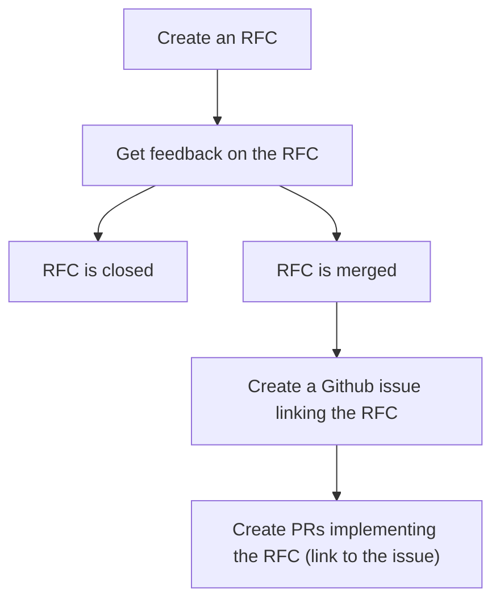

This page contains instructions on how to propose and implement feature changes to Presto.

# The Request for Comments

## Overview of the process

## Step 1: Create an RFC
RFCs are located in their own repository.

To create one:

1. Fork the https://github.com/prestodb/rfcs repository
2. Copy the template file `RFC-0000-template.md` to `RFC-00xx-your-feature.md` and fill it out with your proposal.
   The template is a guideline. Feel free to add sections as appropriate.
3. The RFC may simply link to another editor, like a Google Docs file, but please ensure that the
   document is publicly visible.  This can make the RFC easier to edit, but commenting doesn’t scale very well, so
   please use this option with caution.

## Step 2: Get Feedback on the RFC
1. Submit a pull request [to the main repository](https://github.com/prestodb/rfcs) from your fork titled 
`RFC-00xx-your-feature.md`
2. Before your PR is ready for review,
   [mark the PR as draft](https://docs.github.com/en/pull-requests/collaborating-with-pull-requests/proposing-changes-to-your-work-with-pull-requests/changing-the-stage-of-a-pull-request#converting-a-pull-request-to-a-draft).
3. Once it’s ready for review, [move the PR out of draft](https://docs.github.com/en/pull-requests/collaborating-with-pull-requests/proposing-changes-to-your-work-with-pull-requests/changing-the-stage-of-a-pull-request#marking-a-pull-request-as-ready-for-review).
4. A committer will review your proposal.
5. Build consensus. Those committers will review your PR and offer feedback. Revise your proposal as needed until
   everyone agrees on a path forward. Additional forums you can share the proposal on include the
   [the mailing list](https://lists.prestodb.io/g/presto-dev) and the
   [Slack channel in #dev](https://communityinviter.com/apps/prestodb/prestodb). Tagging interested stakeholders
   (identifiable via [CODEOWNERS](https://github.com/prestodb/presto/blob/master/CODEOWNERS)) can help with consensus building.

_(Note: A proposal may get rejected if it comes with unresolvable drawbacks or if it’s against the long term plans of the Presto committers)_

## Step 3: Implement your Feature
1. If your RFC PR is accepted, then the PR will be merged.
2. As soon as possible, create an issue in Github in the relevant repository (most likely
   [prestodb/presto](https://github.com/prestodb/presto)) summarizing the RFC and linking to it.
3. When you submit PRs to implement your proposal, remember to link to your issue that has a link to the RFC
   so that reviewers catch up on the context.

## Implementing an RFC
Every accepted RFC has an associated issue tracking its implementation in the Presto repository; thus that
associated issue can be assigned a priority via the triage process that the team uses for all issues.

The author of an RFC is not obligated to implement it. Of course, the RFC
author (like any other developer) is welcome to post an implementation for
review after the RFC has been accepted.

If you are interested in working on the implementation for an accepted RFC, but
cannot determine if someone else is already working on it, feel free to ask
(e.g. by leaving a comment on the associated issue).

## RFC Rejection
Some RFC pull requests will be closed without the RFC being merged (as part of the rejection process). A closed RFC
is closed because we would prefer not to evaluate the proposal or implement the described feature
until some time in the future, and we believe that we can afford to wait until then to do so.

## Inspiration
Presto's RFC process owes inspiration to the [PyTorch RFC Process](https://github.com/pytorch/rfcs) and [Hudi RFC Process](https://hudi.apache.org/contribute/rfc-process/).

## License
By contributing to rfcs, you agree that your contributions will be licensed under the LICENSE file in the root directory of this source tree.