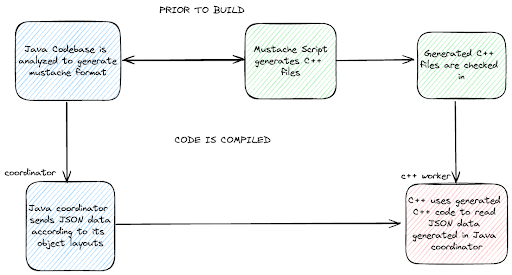
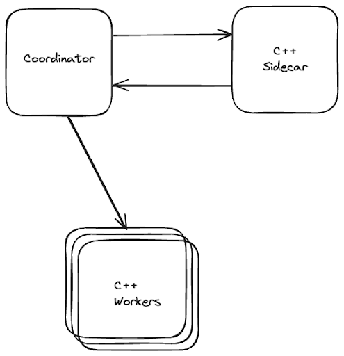
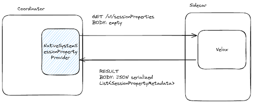
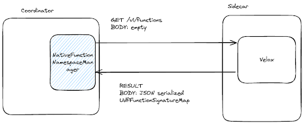
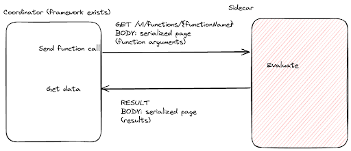
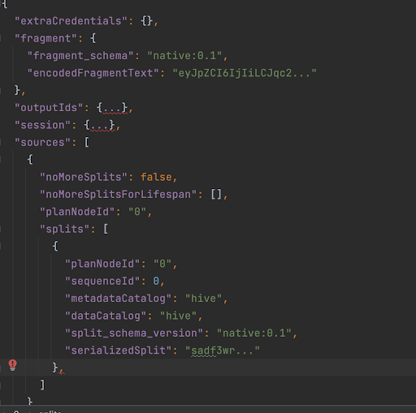
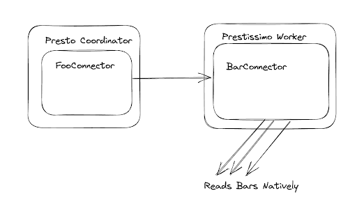
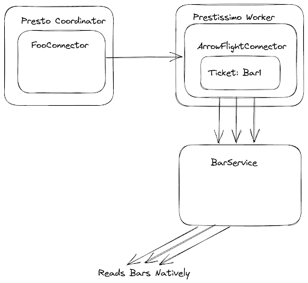

# **RFC-0003 for Presto - SPI for native workers**

See [CONTRIBUTING.md](CONTRIBUTING.md) for instructions on creating your RFC and the process surrounding it.

## SPI for native workers

Proposers

* Tim Meehan
* Aditi Pandit
* Deepak Majeti
* Yi-Hong Wang

## [Related Issues]

N/A

## Summary

Prestissimo is currently hard-coded to work with Hive and TPC-H connectors, and has a hard-coded list of functions, types and operators that are incongruent with the default built-ins found in the Java coordinator.  We propose a new SPI that will allow plugin authors to customize Prestissimo in ways that are currently available in Java clusters.  Additionally, we believe an enhanced SPI can allow better integration with the underlying native evaluation engine, and also potentially open up the possibility for large amounts of code deletion and cleanup in the Presto codebase.

## Background

### Goals

* The coordinator must fail fast if it encounters a query which is not compatible with its underlying evaluation engine.
* All `SHOW` commands must return consistent information to the user. In particular:
  *  `SHOW SESSION` should only show session properties which are compatible with its underlying evaluation engine.
  *  `SHOW CATALOGS` should only show catalogs which are compatible with its underlying evaluation engine.
  * `SHOW FUNCTIONS` should only show functions which are compatible with its underlying evaluation engine. 
* DDL statement compatibility must be consistent with evaluation engine compatibility. 
* Presto must fail fast if one attempts to register a connector which is incompatible with its underlying evaluation engine. 
* Presto must fail to start if one attempts to use a configuration property which is not compatible with its underlying evaluation engine. 
* Presto must fail fast if one attempts to use a session property which is not compatible with its underlying evaluation engine. Presto must fail fast if one attempts to use a connector session property which does not have a corresponding session property in the worker. 
* The connector authoring experience must be updated to reflect the new evaluation engine. In particular:
  * Connector authors should be able to register connectors without deploying custom builds of Presto. 
  * Connectors should always have a way of communicating to the coordinator what types, functions, operators, and session properties are supported. 
  * Connector authors must not be expected to use classes outside of an established SPI. 
  * The Connector SPI must be updated to remove interfaces that are not used by the underlying evaluation engine.


### Non-goals
* It is not a goal to prevent all instances of mismatch/split-brain between Java coordinators and C++ workers.  This will significantly close the gap, however there is a long tail of subtle differences that will need to be worked out over time.

## Proposed Implementation

[For more details on the implementation, see this design document.](https://docs.google.com/document/d/1d8pDKtayun0QKGNjYz9Slaor3-aVYr99k7ZBmrKSOOA/edit?usp=sharing)

### How Prestissimo works

Prestissimo acts as a C++ facade over the Java worker communication layer. Given that Presto workers are designed as RESTful services, the principle way it acts as a facade is through:


1. Proxygen is the framework to send and receive HTTP calls and abstract service endpoints.
2. A script which uses Mustache templates are used to parse and generate the JSON data that flows between coordinators and workers. The code generated from these templates are used to parse and generate the JSON data structures that send and receive data between coordinators and workers
3. Various specializations are added to the Mustache template file to handle corner cases. There are currently 33 specializations as of writing.

HTTP endpoints related to tasks are registered to Proxygen in `TaskResource.cpp`. Important endpoints implemented include:


* POST: v1/task: This processes a `TaskUpdateRequest`
* GET: v1/task: This returns a serialized `TaskInfo` (used for comprehensive metrics, may be reported less frequently)
* GET: v1/task/status: This returns a serialized `TaskStatus` (used for query progress tracking, must be reported frequently)

Other HTTP endpoints include:


* POST: v1/memory
    * This just reports memory, but no assignments are adjusted unlike in Java workers.
* GET: v1/info
* GET: v1/status

The request/response flow of Prestissimo is identical to Java workers. The tasks, or new splits, are registered via `TaskUpdateRequest`. Resource utilization and query progress are sent to the coordinator via task endpoints.




### Current Needs


#### Fail fast 


##### Fail fast for queries that aren’t supported 

Prestissimo does not use the Plugin interface, and so lacks knowledge of built-in functions, built-in types, operators, or connectors. If one attempts to reference any of these custom additions, then the query will fail during execution. While in an under-utilized interactive cluster this may be barely noticeable, some clusters often experience heavy queueing. Even if a cluster experiences only periodic queueing, failing during execution may make the queueing worse as queries which are destined to fail must first be queued and planned for execution before the query fails. We should allow Prestissimo clusters to fail fast queries which will never succeed during execution, similar to Java clusters.


##### DDL type support should be consistent with execution 

Because type support is different between the Java SPI and what is supported in Prestissimo, it’s possible to create views and tables that utilize unsupported types in Prestissimo. For the best user experience, the support should be seamless between DDL and execution. Additionally, for developer ease, there should be just one SPI surface that one must implement to register the built-in types. Finally, it would be nice to implement a system procedure that validates that a type is supported for all tables in a schema, so that customers can quickly understand the support level of the underlying eval.


##### Configuration properties 

Presto validates which configuration properties end up being used by ensuring that all entries in the configuration correspond to a configuration file in the codebase. If one references a configuration that is unused then the Presto server will fail to start. In Java clusters, there are essentially three categories of configuration:

1. Configuration that affects coordinators only.  For example, optimizer session properties such as `join_reordering_strategy` affects only the query plan, and hence requires no knowledge of this session property in the worker.
2. Configuration that affects workers only.  For example, `task_concurrency` affects only the worker level task parallelism, and hence requires no knowledge of this session property in the coordinator.
3. Configuration that affects both.  For example, session properties such as `resource_overcommit` affects both the behavior of the coordinator, to influence the behavior of OOM killer and reserved pool memory promotion, and of the worker, to relax local memory constraints.  Such session properties should be avaiable to both the coordinator and the worker.

All configuration in category 3 no longer applies in Prestissimo clusters because the set of configuration properties is disjoint. There should be a mapping of these configurations to corresponding configuration in Prestissimo, and these should fail fast when they are attempted to be set in coordinators. Many of these properties should be moved to categories 1 and 2, and we should fail fast when such properties are attempted to be set on coordinators.


##### Coordinators can be configured to be workers 

Presently, Presto allows a coordinator to also take on responsibilities as a worker. This doesn’t work in Prestissimo clusters and should likely be deprecated.


#### Ensure consistency between coordinator and worker 


##### `SHOW FUNCTIONS` and `SHOW SESSION` should return only functions and session properties that both the coordinator and worker understands 

The output from these `SHOW` commands return information that are available from Presto’s Plugins and Java-based session properties. Prestissimo clusters have independent ways to register functions and session properties.

Function evaluation may be used during query optimization, so one may continue to register functions that only exist during optimization, or forget to re-register the corresponding native function. For convenience and trust in a sound deployment, Presto should validate that the two are consistent, and ideally have only one SPI surface that one must implement to register the built-in function.

Session properties may additionally include session properties from a connector that are unused. It may be confusing to users to attempt to discern which session properties are tunable for query execution. For clarity, when a user issues `SHOW SESSION`, it should only include session properties that will actually be used by the deployment of Presto.


##### `SHOW CATALOGS` returns only Java SPI catalogs 

When one executes `SHOW CATALOGS`, it will return all catalogs registered via the Java SPI. It is possible to register catalogs that only exist during query optimization, but will not have a corresponding and compatible connector in Prestissimo. While it is possible to register connectors only in coordinators even in Java-only clusters, Prestissimo only supports a subset of connectors that Java supports, and it’s conceivable that people who lack the background of current development efforts may try to use some of these unsupported connectors.


#### Support customizability 


##### Update SPI to reflect split languages of Presto clusters 

When one uses Prestissimo, certain portions of the Connector SPI are not used, including data sinks and data providers. There should be distinction in the SPI when one deploys a Prestissimo cluster that such classes are not needed.

The Presto connectors will generate splits that are serialized to the workers. The serialization happens by examining the Java object structure and generating JSON that mimics that structure. It appears that the Prestissimo code to parse these JSON structures requires a custom build. We should update the SPI so that a custom build is not needed, and instead one can serialize and deserialize these structures in a way that is customizable and not known to the engine.


##### Enable Presto connectors, types and functions 

Prestissimo needs to have the same customizability as the prior Java code before it.  This means there needs to be configurable connectors, types and functions that allow users of Presto to customize it for their deployments.  This should not involve building Presto itself–the framework should be lightweight and achievable for data engineers, without troubleshooting overall issues related to building Presto as a whole.


### Goals 


1. The coordinator must fail fast if it encounters a query which is not compatible with its underlying evaluation engine.
2. All `SHOW` commands must return consistent information to the user. In particular:
    1. `SHOW SESSION` should only show session properties which are compatible with its underlying evaluation engine.
    2. `SHOW CATALOGS` should only show catalogs which are compatible with its underlying evaluation engine.
    3. `SHOW FUNCTIONS` should only show functions which are compatible with its underlying evaluation engine.
3. DDL statement compatibility must be consistent with evaluation engine compatibility.
4. Presto must fail fast if one attempts to register a connector which is incompatible with its underlying evaluation engine.
5. Presto must fail to start if one attempts to use a configuration property which is not compatible with its underlying evaluation engine.
6. Presto must fail fast if one attempts to use a session property which is not compatible with its underlying evaluation engine. Presto must fail fast if one attempts to use a connector session property which does not have a corresponding session property in the worker.
7. The connector authoring experience must be updated to reflect the new evaluation engine. In particular:
    4. Connector authors should be able to register connectors without deploying custom builds of Presto.
    5. Connectors should always have a way of communicating to the coordinator what types, functions, operators, and session properties are supported.
    6. Connector authors must not be expected to use classes outside of an established SPI.
    7. The Connector SPI must be updated to remove interfaces that are not used by the underlying evaluation engine.


### Design 


#### Coordinator sidecar 

As outlined in the sections below, a coordinator sidecar process is developed to add C++-only functionality to the Java Presto coordinator.  Such C++-only functionality is needed to avoid duplicating registration of various components of Presto such as functions, session properties and connectors, and also to support certain optimizer functionality such as constant folding.

While other forms of communication may also achieve these goals, such as using JNI to call to a library which contains the necessary functionality, these had certain downsides, such as fragility (leading to coordinator crashes due to potential bugs in C++) and difficulty in programming the JNI interface.  However, this design is not opposed to a JNI approach, and merely prefers the sidecar approach for its simplicity and flexibility.

The sidecar process is essentially a Prestissimo worker which announces itself as a coordinator sidecar to the coordinator through the discovery service announcement payload.  There is a new flag `sidecar`, which when set to true indicates to the coordinator that it may function as a sidecar.  In the future, we may attempt to reduce the binary size if needed by removing unnecessary endpoints.

The coordinator will have extra utilities to wait for the sidecar process.  It will be configured to wait during startup in the coordinator for a sidecar announcement, during which queries will wait a configurable amount of time before timing out.

The sidecar will have extra endpoints enabled that facilitate session properties reporting, functions registered, and function evaluation for constant folding.  This is explained in more detail in the following sections.




#### Session Properties 

Currently, session properties must be defined in two places: in the Java coordinator, and in the Prestissimo worker.  Ideally, session properties required by the C++ code are defined in the C++ code itself.  There are several reasons for this:


1. In Java, session properties are singularly defined and used in a friction-free manner.  In C++, one must define them in two places, as a Java session property, and as a property in Prestissimo, which introduces more overhead to define a session property.
2. Session properties defined in C++ are naturally segregated from session properties used in Java.  By having segregation, we can move to create three types of session properties, making it clear for documentation to operators which session property should be applied:
    1. Session properties defined for use in the Java coordinator.
    2. Session properties defined for use in the Java worker.
    3. Session properties defined for use in the C++ worker.


##### How to define C++ worker session properties 

Currently, in the QueryContextManager, session properties are translated as config values to Velox.  This misses the opportunity to configure purely Prestissimo session properties.  Instead, Prestissimo should have a similar session property configuration management system as Java.

There will be a number of lists of session properties in code which define the core of the session property: the name, the type, the description, whether or not it’s hidden, and the default value.  It will also have metadata that informs how to convert the session property to the relevant Velox config.  Initially, there will be a SystemSessionProperties list of session properties which will capture most session properties required.


##### How to define C++ worker connector session properties

Connectors may define session properties that are not known to the engine.  To support these, each PrestoConnector will define a list of session properties with the exact same properties as above.

Connector properties will initially be added to the work in [#22044](https://github.com/prestodb/presto/pull/22044).  Eventually, once true connectors are supported, these may be loaded at connector registration time, which will be slightly after the process is loaded.


##### How worker session properties will be known to the coordinator

Worker session properties in the scheme above are defined in C++.  Yet the coordinator must still validate session properties and also show the listing of session properties in SHOW SESSION.  In order to support this, a `SessionPropertiesReporter` class will aggregate session properties from SystemSessionProperties and for each connector.  This will be used by a new Proxygen endpoint, `/v1/sessionProperties`, which will return the session properties in a well-known JSON format.

The coordinator will have a new plugin type, `SessionPropertiesManager`.  This plugin may be created to add new session properties at a system level to the coordinator (similar functionality already exists at the connector level).  An instance of this plugin will be created to facilitate native session properties, `NativeSessionPropertiesManager`.  This will lazily load data from the `/v1/sessionProperties` endpoint in the sidecar and cache it.

Session properties that originate from `SessionPropertiesManager` are merged with built-in session properties, and hence show up in `SHOW SESSION` and may be set as any other session property, even though they are not used in the Java code (achieving goal N2).

Once this work is completed, we can create a `JavaWorkerSessionPropertiesManager` that manages purely Java worker session properties.  We can migrate existing Java worker-only session properties to this new plugin as and when they are identified.  This can be a default plugin to ensure continuity and prevent disruption in Presto users’ deployments.




#### Functions validation and execution

As the source of truth will now be whatever functions are registered in Velox, the coordinator must have a master list of these functions that is consistent with whatever is registered, otherwise functions will parse correctly according to whatever is registered in Java, yet fail during execution.  Additionally, `SHOW FUNCTIONS` should simply show functions that are eligible for execution.


##### How functions will be known to the coordinator

Velox already registers all functions for execution.  Additionally, it’s already possible to obtain a list of functions from Velox.  In order to report these functions to the coordinator, a new endpoint will be added, `/v1/functions`.  A `GET` to this endpoint will return the total list of all functions registered in Velox in JSON format.  The particular format will be compatible with `UdfFunctionSignatureMap`, an existing JSON serialization format currently used to load function definitions from files.

Presto can already define custom functions with the existing SPI interface `FunctionNamespaceManager`, which facilitates the execution of SQL functions and remote UDFs.  We will enhance this integration in the Presto engine to permit the execution of remote functions during constant folding.  A new implementation will be added, `NativeFunctionNamespaceManager`.  This manager will retrieve the list of functions from the sidecar’s `/v1/functions` endpoint.

Functions returned from this endpoint should behave as built-in functions to the user.  Built-in functions are currently simply functions that don’t require a catalog and schema to be specified when they are executed.  Because each `FunctionNamespaceManager` registers itself to the coordinator with a catalog and namespace to refer, we must allow the functions from the `NativeFunctionNamespaceManager` to be addressed as if they were built-in functions.  To support this, the built-in namespace will be become configurable, and a `FunctionNamespaceManager` can indicate to the coordinator that its own namespace should be considered the default namespace.  The coordinator will validate that only one such plugin has specified itself as a default namespace.  The `NativeFunctionNamespaceManager` will indicate that it is a default namespace, and hence will replace built-in functions in Java.




##### How will constant folding work

###### What is constant folding?

Constant folding is the process of optimizing, then simplifying expressions by evaluating them to a constant value.  This is a common optimization technique in compilers, and is used in Presto to simplify expressions during query planning.  For example, the expression `1 + 2` can be simplified to `3` during constant folding.  This is particularly important to do in the coordinator because it may reduce the amount of partitions that are discovered during planning.

###### How will constant folding work in Presto?

A new endpoint will be added, `/v1/functions/{function_name}`.  A `GET` to this method will return function output as a page with just one block and just one row.  It will take in parameters `arg1`, `arg2`, …, `argN` and `returnType`, all of which will be serialized `TypeSignature` values.  The C++ sidecar will interpret the type signatures and resolve a function, convert the Presto page, evaluate the function, then return the results as a Presto page and send back to the coordinator.

`RowExpressionInterpreter` is used to simplify expressions, in particular for constant folding.  Currently, it will only evaluate Java functions directly, and also SQL functions.  We can extend support in this class to allow for off-process evaluation of remote functions.  We will modify CPP based functions to be allowed to be evaluated in-coordinator, and using the existing FunctionNamespaceManager framework to evaluate the functions.

Special form expressions ultimately are reduced to operators during optimization.  For example, the following expression:

```sql
id = (1 + 1) and retailprice < orderprice
```

is reduced to the following operators:

```text
AND(GREATER_THAN(id, CAST(ADD(1, 1))), LESS_THAN(retailprice, CAST(orderprice)))
```

Constant folding would simplify the expression to:

```text
AND(GREATER_THAN(id, 2), LESS_THAN(retailprice, CAST(orderprice)))
```

Such operators are individually evaluated.  The `RowExpressionInterpreter` will evaluate the operators, and if it encounters a function that is not a built-in function, it will call the sidecar to evaluate the function.  The sidecar will return the result of the function evaluation, and the coordinator will continue to evaluate the expression.  In the case of above, one RPC call would be made to simplify the `ADD` operator.

A downside of this approach is it may involve lots of local RPC calls in the case of lots of expressions that can be constant folded, which may add some latency for certain queries.  We are designing an improvement to this process that involves sending whole expressions to Prestissimo to reduce the number of local RPC calls.  A new RFC will be created for this process.  Further improvement may be made by using JNI to evaluate the expressions, however it is not clear if this will be necessary and such a design would only be made based on empirical observations.




#### Types validation

Presto types include informational components, such as whether or not the type is orderable or can be hashed, and utilities to read and write data.

The list of built-in types needs some components of Java code in order for it to be used in the optimizer.  The list of built-in types is manageable and small, hence it’s acceptable to keep the implementations in Java.  For user-defined types, we can split the Type interface into two parts: read-only and write.


#### PluginV2

Because a single Plugin interface does not cover all the customization requirements for both workers and coordinators, it must be forked to reflect the split processes. The new Plugin interface will share certain similarities with the previous interface as outlined below, with several drastic differences.

Additionally, split coordinator/worker pairs must be disallowed: in order for native clusters to be the default deployment, we need to deprecate execution related code, which means coordinators must not be allowed to take on any worker responsibilities. [N8]


#### ExecutionPlugin

Because there may always be a difference in compatibility between C++ and Java worker processes[^1], an ExecutionPlugin is added to PluginV2 in order to express the capabilities of the worker fleet. The broad capabilities this plugin expresses are:


##### PlanNode support

A PlanNodeChecker class is added to provide support for returning information on the compatibility of a PlanNode.  Compatibility is defined as support for each node and node properties in the plan.  If it is compatible, an object is returned which indicates it is fully compatible.  If it is not compatible, then an object is returned which indicates a list of nodes and properties which are incompatible.

An initial implementation of such a checker may entail either a call to a service, for example a sidecar process, or a JNI call which invokes the Prestissimo deserialization logic.


##### PlanNode serialization

PlanNodes must be serialized to the downstream workers in a format that is understood by the worker.  While Prestissimo currently attempts to fully mimic Presto plan nodes, in the future it may be desirable to shift to open formats such as Substrait in order to provide maximum compatibility with downstream execution engines and in order to provide an independent schema which can be used for compatibility checking.

A PlanNodeSerializer is added which takes in a PlanNode tree and returns a byte[] to be used for serialization downstream.

Creating a new serializer other than JSON serialized Presto Plan nodes will entail a long effort.  For the sake of incremental progress, the initial implementation may simply be a byte array contents of a JSON serialized PrestoPlan node, as Prestissimo already has the code to deserialize this.


##### Functions listing and evaluation

To support both the listing of functions (for analysis and SHOW FUNCTIONS) and evaluation of functions (for constant folding), we’ll use the `FunctionNamespaceManager` found in SPIv1.

A new implementation will be added to support listing and evaluation of sidecar functions, and a small configuration will be added to allow for the default function namespace to be changed to the namespace of the `FunctionNamespaceManager`.

By integrating with existing SPI components, we can return a list of Functions which may be used during parsing and analysis in order to quickly check for compatibility with the underlying evaluation engine.


##### Types supported

Returns a list of Types which may be used during parsing and analysis in order to quickly check for compatibility with the underlying evaluation engine.

Plugin already has a Types parameter.  It will be ported into PluginV2 and two default plugins will be created, one for each underlying eval (Java and Prestissimo).  In Velox, there should be a way to return the list of types from the library that Prestissimo can call into.


##### Parametric types supported

Returns a list of Types which may be used during parsing and analysis in order to quickly check for compatibility with the underlying evaluation engine.  Implementation will be as above.


##### Session properties supported

Session properties may be used in the coordinator, worker, or both.  Session properties which exist solely in the worker need to be communicated back to the coordinator in order for the session property to be validated, and also in order for the session property to be shown during SHOW SESSION.

In addition, we must differentiate between pre-existing session properties and PluginV2 session properties: pre-existing session properties may be used in the worker, where they’ll go silently unused.  We can add a tag to all session properties indicating which version of the Plugin SPI it corresponds to: V1, V2, or both.  All pre-existing session properties must at least belong to V1, and some chosen session properties known to be useful in native can additionally belong to V2.  Going forward, we make a choice as to which version of the SPI they correspond to.

From an implementation perspective, Velox must return the list of session properties it supports that can be returned back to the coordinator.  Session properties must be migrated from being statically known to dynamically known, and their registration must happen in relevant plugins.  It is an open design question how to accomplish this decoupling.


#### MetadataConnector and DataConnector

The current Connector SPI, a part of the Plugin SPI, spans concerns both in the worker and coordinator.  Prestissimo implicitly creates a divide in the code between coordinator and worker, which will be formalized in configuration.

Prestissimo has no concept of connector and manually decodes structures found in SPI, core engine and connectors.  In order for the new architecture to support the same level of federation capabilities which are used by nearly all users of Presto, its design needs to be updated to provide a pluggable mechanism to interpret connector-specific data structures such as splits.

We can split the Connector SPI into two parts: MetadataConnector and DataConnector.


##### MetadataConnector

The MetadataConnector, as suggested by the name, is limited to interaction with metadata of underlying storage systems.  Such metadata includes split enumeration, partition discovery, and schemas.


###### ConnectorMetadata

The typical ConnectorMetadata structure may be ported to ConnectorMetadata as-is from the Connector interface.


###### ConnectorSplitManager

The typical ConnectorSplitManager may be ported to ConnectorMetadata as-is from the Connector interface.


###### SystemTables

The typical SystemTables implementation may be ported to ConnectorMetadata as-is from the Connector interface.


###### Procedures

This requires research as to whether or not procedures need to be executed on workers or may be executed on coordinators.


###### SessionProperties

Session properties which apply to metadata location may be ported as is.


###### SchemaProperties

Schema properties may be ported as is, as any relevant properties for execution would be carried over into the split.


###### TableProperties

Table properties may be ported as is, as any relevant properties for execution would be carried over into the split.


###### ColumnProperties

Column properties may be ported as is, as any relevant properties for execution would be carried over into the split.


##### DataConnector

Whereas the MetadataConnector is specified through an SPI, which is customizable Java code that configures the metadata for the coordinator, DataConnectors must live in the worker and will not be able to use the same Java code found in the coordinator.  The communication with DataConnectors is therefore done through an API.

DataConnectors will have two general approaches: fast path and slow path.  Fast path DataConnectors will have dedicated connectors available in Velox and Prestissimo which natively interpret the incoming split.  Slow path connectors will not natively interpret the split; instead, they’ll receive opaque tickets, which are then used by an all-purpose connector in Prestissimo and Velox to receive and write data as an external service.


###### The DataConnector API

The worker will need two components to interpret the task update requests from the coordinator: split schema and table handle.


_An example of a TaskUpdateRequest using the new schema_


####### Split schema

The DataConnector will attempt to deserialize an opaque byte[] into a specific type that can be used for query processing.  The MetadataConnector must serialize this in a way that can be deserialized by the DataConnector.

Schema encoding is done in two separate processes, the coordinator and worker.  Providing consistent encoding support over two separate languages may be challenging, as they may entail different release pipelines outside of the core Presto repo.  Additionally, while the Hive connector in Velox is being envisioned as encapsulating the needs of many table formats, such a unified design seems more difficult for the metadata (where table format differences are much more acute).  For these reasons, it may be worthwhile to introduce a token which indicates the version of the schema being supported: this would allow the DataConnector and the MetadataConnector to be independently developed.

As a contrived example, suppose a new summary data structure is added to the split format which may be used to provide an alternative, faster, location of a data file.  Without versioning support, care must be taken to ensure that the MetadataConnector and DataConnector can deserialize the exact same split.  With versioning, workers can announce to the coordinators which version of the split schema is supported, which can be validated with the versions supported by the coordinator.  The indication of which split schema itself can be used to signal which capabilities are supported in the underlying connectors in the eval engine.


####### Table handle

The worker will receive a data structure that consists of a reference to the data connector and an opaque byte[] that may be deserialized to a DataConnector specific structure which can be used to configure the table scan.

Schema evolution can be managed as above, since it’s the same problem.


##### Fast Path DataConnector

A fast path connector will natively interpret the split and table handle information during task update requests.  Prestissimo will have code that can be configured to recognize various connector specific data structures and map them to data structures accessible in Velox.  Ideally, this is done in a modular manner, similar to Presto connectors (perhaps through shared libraries).

Velox connectors are created for each fast path DataConnector to ensure optimal performance.  This means it’s an expensive proposition to create a fast path DataConnector, as such connectors will entail an expensive engineering effort.


####### 



_An illustration of a “fast path” connector_


###### Prestissimo Connectors

A corollary for this work is Prestissimo needs to have first class support for pluggable connectors.  While Velox supports a similar concept accomplished through shared libraries, Prestissimo hard codes the TaskUpdateRequest instructions related to the plans and splits, which makes it impossible to support dynamic connectors.

To accomplish this, we can send across the DataConnector catalog id with the TaskUpdateRequest.  Prestissimo can validate the id and then look up the connector associated with that ID.  There will be a pluggable mechanism to deserialize the TableHandle and Split associated with the connector–an enriched connector registration mechanism, which not only loads the Velox connector, but also loads components which handle the deserialization of these data structures.


##### Slow Path DataConnector



_An illustration of a “slow path” connector that will use an external service call read data_

A slow path data connector will use one generic DataConnector in Velox and Prestissimo to interpret generic splits and generic table handles which are themselves sent to an external service for processing (roughly, data sinks and data providers in the old Connector API).

In essence, a “Slow Path Connector” is really a generic “Hot Path Connector”--it will use Velox connectors to make remote service calls to put and receive data, and it will use the same deserializers mentioned in the section above to deserialize the generic splits and TableHandles.  The primary difference between the two is that while hot path connectors are purpose built, and require repeated effort per connector to implement, slow path connectors are generic and built once, with users implementing services which provide the functionality.


###### Arrow Flight

The Arrow Flight Ticket concept corresponds exactly to the remote DataConnector concept.[^2]  We propose that one type remote DataConnector could be an Arrow flight server.  This will have a number of advantages:


1. Existing efforts are underway to develop an Arrow Flight connector.  This offers a straightforward migration path to such connectors.
2. Arrow Flight aims to be a standard, and the Presto project does not stand to lose by leveraging an existing open standard.  Rather, it can expand its reach by more tightly integrating into the Arrow ecosystem.
3. Velox has decent integration into Arrow binary format, and leveraging such a format would avoid data copies.[^3]
   While efforts could revolve around doing similar work in Thrift, this has a number of disadvantages.
4. There is very little usage of the Thrift Connector.  While Arrow Flight doesn’t seem to have broad usage, it is certainly more used than Thrift Connector.
5. Thrift has largely fallen out of favor in industry usage in place of gRPC, and more production systems are likely to have good support of gRPC than Thrift.
6. gRPC has better native streaming integration than open source Thrift.[^4]
   Presuming we take on Arrow Flight as the standard for remote DataConnectors, then a remote DataConnector is simply an ArrowFlight server who has implemented the methods used to process Flight Tickets.  This may or may not be in the same process as the Flight service used to query metadata.


###### Thrift

The existing Presto Thrift Connector can be split into two parts in the same way that the Arrow Flight service splits Flights from Tickets.  A Thrift PrestoThriftSplit may be sent to Prestissimo workers, which can then make a Thrift call to the addresses specified in by the split.

In order to implement this form of remote connector, a native connector must be built in Velox to interpret PrestoThriftSplit and ThriftTableHandle.

Unlike Arrow Flight, the Thrift Connector only supports reads.[^5]  Future work could add write support to the Thrift connector.


##### MetadataConnector and DataConnector synchronization

Because MetadataConnector and DataConnector may be developed independently, care must be taken to ensure that they remain compatible over time.


###### Announcement

When connectors are added to Presto, they are announced inter-process and loaded dynamically.  MetadataConnector can behave in exactly this way, but DataConnector must behave differently–it should announce itself intra-process to the coordinator so that the coordinator can maintain and validate a mapping of metadata to data catalogs.

A cataloging concept must exist for both metadata and data connectors, because both may be configured differently and independently.  Any data connector catalog entry that is unknown to the coordinator must be disallowed, as this may cause runtime errors during query processing.  The above process facilitates fast validation of this mapping.

Technically, such a mapping may be a common configuration to all metadata connectors: simply a list of data connector catalog entries that are known to the metadata connector entry will be sufficient.

This code may exist in the existing announcement code.


##### Migration and Backwards Compatibility with Connector

All of the functionality described above can be encapsulated with:

1. Calling methods in PluginV1 classes from PluginV2 classes
2. Providing default Java functionality

A shim will be developed which will allow initial portability between Java connectors and Arrow Flight C++ connectors.

<!-- Footnotes themselves at the bottom. -->
### Addenda


1. What modules are involved
   2. There will be a new plugin interface to support the additional functionality of registering native functions, supporting their evaluation, registering native types and session properties, and registering and communicating with connectors.  This will affect the Presto SPI, the Presto engine, and the native worker module, with additional work in Velox to support dynamic loading of code to register functions and connectors.
2. Any new terminologies/concepts/SQL language additions
   3. There will be a new SPI footprint, which will eventually be used to deprecate the older Java-specific SPI.
3. Method/class/interface contracts which you deem fit for implementation.
   4. Please see design document for details.
4. Code flow using bullet points or pseudo code as applicable
5. Any new user facing metrics that can be shown on CLI or UI.
   6. There will be no new user facing metrics as a part of this work. 

## Metrics

N/A

## Other Approaches Considered

* Hybrid clusters -- rather than exposing the differences between C++ and Java to the user, one could run hybrid clusters with both Java and C++ workers.  It is anticipated that the resource management and performance challenges this would create would be non-trivial and would not result in a productive outcome for Prestissimo adoption.  It also doesn't solve the egonomic challenges of C++ connector and function authoring.
* Coprocessors -- one could run colocated Java workers on the same nodes as C++ workers, and use coprocessors to communicate between the two.  This would create significant resource management challenges as Presto clusters presume singular pools of memory--such memory would need to dynamically shift between native and Java processes, a challenge made difficult by the Java worker's use of Java heap memory as opposed to off-heap memory.  It also doesn't solve the egonomic challenges of C++ connector and function authoring.
* Dual clusters -- one can attempt to run two separate clusters, one that is purely Java, and one that is purely C++.  This would waste resources in due to the always-on nature of Presto clusters and the anticipated unequal load between the clusters.  Additionally, it would result in a poor user experience when queries which differ only by, e.g. a single unsupported function, have drastically different performance owing to their running on the Java cluster.  It also doesn't solve the egonomic challenges of C++ connector and function authoring.

## Adoption Plan

- What impact (if any) will there be on existing users? Are there any new session parameters, configurations, SPI updates, client API updates, or SQL grammar?
  - There will be a migration path to the new SPI.  The Presto project will be required to maintain both for a period of time.
- If we are changing behaviour how will we phase out the older behaviour?
  - We believe that C++ is a foundational change in Presto's architecture, and as such there will be small behavior differences with Java.  We will document such minor differences and encourage users to migrate to the new architecture at will.
- If we need special migration tools, describe them here.
  - There will be a new framework to translate SPI v1 connectors to SPI v2 connectors.  Such a migration will be documented and publicly available for connector authors.  Ideally, the work required to complete this migration will be minimal and configuration based. 
- When will we remove the existing behaviour, if applicable.
  - No existing behavior will be removed.
- How should this feature be taught to new and existing users? Basically mention if documentation changes/new blog are needed?
  - There are several ways we will spread awareness of this architecture:
    - We will add documentation for all new SPI interfaces and additions.
    - We will add blog posts and articles describing the change and its benefits.
    - We will announce progress through various forums, such as the TSC meeting and working group meetings.
- What related issues do you consider out of scope for this RFC that could be addressed in the future independently of the solution that comes out of this RFC?
  - While this RFC will allow us to deprecate the Java worker, a separate RFC should be made that describes the deprecation process.

## Test Plan

Integration tests will be made for various ad-hoc connectors in Prestissimo, new functions in Prestissimo, and new types and session properties.  We will also add benchto tests as needed, and product tests to prove end to end reliability.

[^1]:
Presto maintains an SPI which allows for custom types, functions, block encodings, connectors, and other functionality which spans both worker and coordinator.  We maintain this SPI was a foundational design decision in Presto’s architecture and must be maintained going forward to retain the Presto user base and allow it to flexibly adapt to future architectural changes.  Because this SPI spans both coordinators and workers seamlessly, it’s not possible to know the ways users of Presto customize it upfront.  For example, we don’t know the total custom functions registers, the custom types registered, nor the custom connectors.  For more details on the importance of the Plugin interface, see [Presto: SQL on Everything (ICDE 19)](https://research.facebook.com/publications/presto-sql-on-everything/).

[^2]:
[https://arrow.apache.org/docs/format/Flight.html#downloading-data](https://arrow.apache.org/docs/format/Flight.html#downloading-data)

[^3]:

     [https://vldb.org/pvldb/vol15/p3372-pedreira.pdf](https://vldb.org/pvldb/vol15/p3372-pedreira.pdf) - “Velox provides a conversion API for engines that need to be interoperable with Apache Arrow, performing zero-copy format conversion when possible, and re-arranging the data when needed.“

[^4]:

     [https://grpc.io/docs/what-is-grpc/core-concepts/#server-streaming-rpc](https://grpc.io/docs/what-is-grpc/core-concepts/#server-streaming-rpc)

[^5]:
[https://arrow.apache.org/docs/format/Flight.html#uploading-data](https://arrow.apache.org/docs/format/Flight.html#uploading-data)