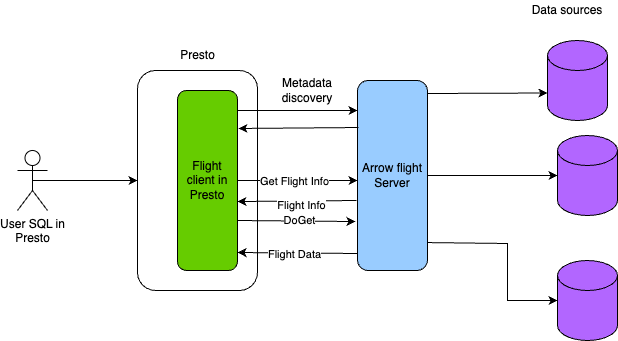
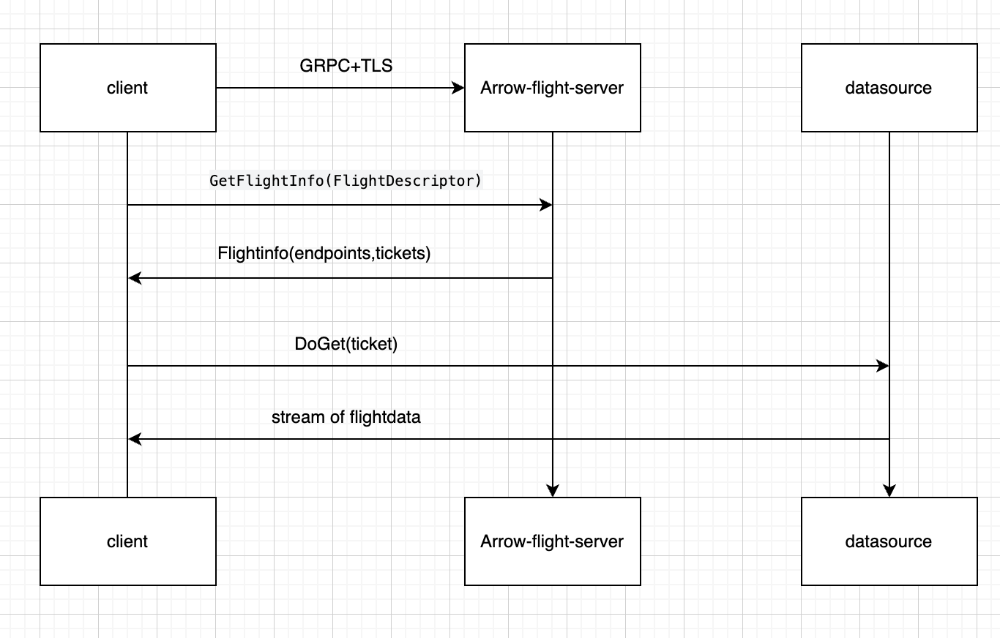
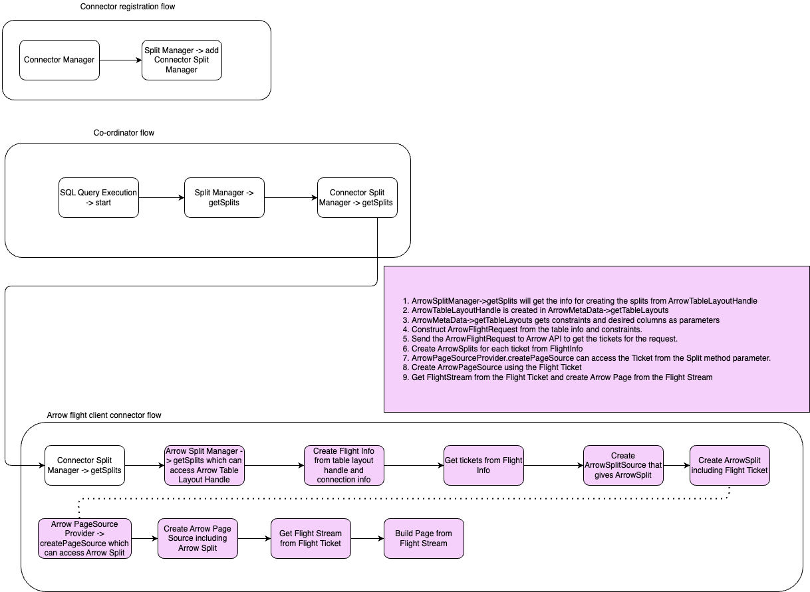

# **RFC-0004 for Presto**

## Arrow Flight connector template in Presto

Proposers

* Elbin Pallimalil
* Ashwin Krishna Kumar

## [Related Issues]

https://github.com/prestodb/presto/issues/22729

## Summary

Create a base Arrow Flight module in Presto which can be extended to create an Arrow Flight connector.

## Background

Apache Arrow Flight is a new general-purpose client-server framework that simplifies high performance transport of large datasets over network interfaces. https://arrow.apache.org/blog/2019/10/13/introducing-arrow-flight/

Presto currently supports different datasources through connectors for each type of datasource. The connectors can use JDBC or some other protocol for datasource connection. If we use Flight client to connect to the different datasources we can improve the performance of the datasource connection. 

## Proposed Implementation

A template for Flight connector will be created as `presto-base-arrow-flight` module. Since each implementation of flight server will be different, this base module can be extended to create a flight connector that supports a particular implementation. The template will support only read operations.

### High level design

#### Proposed design



The Arrow Flight libraries provide a development framework for implementing a service that can send and receive data streams. Flight APIs are used to retrieve the data from the selected table. The steps below need to be followed. 

1. Create a Flight Client using the host, port, ssl information of the Flight service. 
    1. Maintain a connection pool of Flight clients.
    2. Reuse a Flight client from the pool that is already connected to the same location.
    3. Evict connections from the pool using the Least Frequently Used strategy.
2. Use the Flight Client from the pool mentioned above to connect to the Flight service. 
3. Create a FlightDescriptor using a command
    1. The connector template will define an abstract class that returns a byte array.
    1. The concrete implementation of this connector template will define a class that returns a byte array for the `FlightDescriptor.command` method. 
    2. The concrete implementation will specify the necessary details for the database connection in the `command` byte array.
4. Use the FlightDescriptor to obtain a FlightInfo object.
    1. The FlightInfo object will be got from FlightClient by authenticating to the FlightClient using a bearer token.
    2. The concrete implementation of the connector is responsible for generating or providing the bearer token.
5. Use the FlightInfo object to obtain the list of endpoints we will be retrieving data from. 
6. Use each endpoint to obtain a Ticket. 
7. Use the Ticket to obtain a Stream. 
8. Use the Stream to read data. 
    1. Get VectorSchemaRoot from Flight stream
    2. For each column in the result, build a Block from the FieldVector
    3. Return a page with all the constructed Blocks.
    4. Return new pages until all the Flight streams are read.

#### Query execution using flight



### Low level design

#### Connector splits in Presto for FlightInfo tickets

Flight server can serve data using multiple tickets based on the connector type and query. Data can be fetched in parallel using the multiple flight tickets. 

Flight descriptor will be created from a command of byte array. The concrete implementation is responsible for providing the byte array that differs from server to server. Flight Info will be got from the Flight Descriptor. Presto can create connector splits for each ticket from Flight Info so that data can be fetched in parallel by different worker nodes.




## Prestissimo Implementation
A single Prestissimo connector will handle all concrete instances of the Java Arrow Flight connector. This is possible because the prestissimo connector does not have to deal with metadata fetch and discovery. Each split wraps a ticket and a list of locations, which is all[^1] that is required to fetch data from the Flight Service in an implementation-agnostic way.

[^1]: Authentication is one exception which cannot be handled in a truly generic manner. A solution is proposed below.

### Arrow Record Batch to Velox vectors
Arrow arrays and Velox vectors binary compatible with the Arrow C Data Interface.
- Velox provides bridge methods to convert Velox vectors to-and-from from the C Interface [(Link)](https://github.com/facebookincubator/velox/blob/main/velox/vector/arrow/Bridge.h)
- The Arrow SDK provides bridge method to convert Arrow arrays to-and-from the C Interface [(Link)](https://arrow.apache.org/docs/cpp/api/c_abi.html)

The Arrow Flight SDK returns data in the form of Arrow Arrays, which can be converted into Velox vectors by using the provided bridge methods, using the Arrow C Interface as an intermediate representation. In most cases, these are cheap operations that don't involve copying or translating the actual data buffers.

### Serialization of Tickets and Locations

- Ticket: Represented as a `byte[]` in Java and `std::string` in C++. Jackson serializes `byte[]` objects as a base64-encoded string. The encoding/decoding is implicit in the Java implementation, but needs to be decoded explicitly in the C++ worker.

- Location: Represented as a `List<String>` in Java and `std::vector<std::string>` in C++. Serialization is handled entirely by existing the structures.

### Plugin-style authentication
The worker needs to authenticate with the Flight server to redeem the Flight Ticket. This cannot be handled in a truly generic manner since the Arrow Flight protocol allows a lot of freedom to implement custom authentication strategies. Each implementation of a flight service may require custom code to handle authentication.

We propose to solve this by adding plugin-style authenticators to the prestissimo connectors. A Flight catalog can optionally specify an authenticator to use:
```properties
connector.name=arrow-flight
flight.auth.name=simple-user-pass

# The following are examples of authenticator-specific properties
# In presto, the concrete module should handle them
# In prestissimo, the authenticator plugin will handle them
flight.auth.user=me
flight.auth.password=itsme
```
In the above case, the authenticator registered as `simple-user-pass` will be used to authenticate all Flight requests for that catalog. More authenticators can be created and registered using an interface similar to the interface for connector creation and registration in Velox.

The authenticator plugin can read credentials from:
- The catalog configuration file.
- Any `extraCredentials` passed by the client. This would allow the Flight data source to separately authenticate each user of the presto cluster without necessarily providing the same level of access to each user.

`FlightConnector` and `FlightDataSource` store a pointer to the `Authenticator` object to use. There is no need to specialize these classes for handling authentication.

### Connector registration
All concrete implementations of the presto connector will map to the same connector in prestissimo. For example, assume there are two concrete implementations of the base module in Java - `arrow-flight-ibm` and `arrow-flight-sql`. In this case, `connector.name` values of `arrow-flight`, `arrow-flight-ibm`, `arrow-flight-sql` would all reference the same connector implementation in prestissimo.


## [Optional] Other Approaches Considered

Based on the discussion, this may need to be updated with feedback from reviewers.

## Adoption Plan

Whoever needs to implement a Flight connector for their particular implementation of Flight server will need to extend the `presto-base-arrow-flight` module and create a Flight connector module. Documentation will need to created on how the base module can be extended and what type of customizations are required in the child module.

## Test Plan

Unit tests can test the `presto-base-arrow-flight` module by testing with a Flight server instance spun up locally. 

A POC has already been developed by creating `presto-base-arrow-flight` module and a child module that targets the IBM flavor of the Flight server. The IBM Flight server can be used to test the base connector template.


