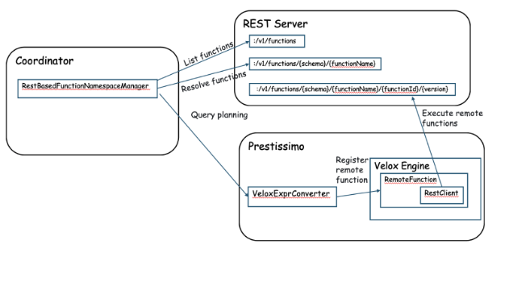

# **RFC-0007 for Presto**

## [Title] REST API for remote functions

Proposers

* Tim Meehan
* Abe Varghese
* Joe Abraham
* Jakob Khaliqi

## [Related Issues]

* https://github.com/prestodb/presto/issues/14053

## Summary

### Dynamic functions in remote function servers

A new REST API is defined, along with a REST plugin implementation, which allows for consistent and unified metadata and execution
of remote functions in a single API definition.  This API is designed to be extensible, allowing for the definition of new functions
at runtime.

## Background

[prestodb/presto#14053](https://github.com/prestodb/presto/issues/14053) introduced the ability to define functions as being executed
in a remote server, and made changes to the planner to accommodate remote function execution.  A limitation of the current implementation is that it
presumes the functions returned from the function server is purely static.  However, it is common in many cloud data warehousing
systems to allow for defining remote functions at runtime through `CREATE FUNCTION` statements.  This RFC proposes to extend the
remote function design to allow for dynamic function registration and execution.

Additionally, the current implementation of the remote function server plugin implementation is agnostic to the API of the function
server.  The lack of a reference API, and additionally lack of documentation around function namespace managers, makes it
challenging to create a remote function server: in addition to creating a new function server API, you also need to define a new
namespace manager plugin.  To allow for a more consistent and unified experience, this RFC proposes a new REST API for remote function
servers, which will allow for the definition of functions at runtime.  The hope is to reduce the work required to integrate a custom
function server with Presto, firstly by reducing or eliminating the work required to write a new plugin, and secondly, by providing
a reference implementation which itself will be extensible and hopefully cover most needs.

### [Optional] Goals

* Standardize on a single preferred API for remote function servers
* Unify the metadata and execution of remote scalar functions under a single API
* Allow for the definition of scalar functions at runtime

### [Optional] Non-goals

* Deprecate existing function server APIs
* Provide support for aggregate functions or table-valued functions

## Proposed Implementation

### Design

Fundamentally, the design of the REST API for remote functions will be based on the existing `FunctionNamespaceManager` interface SPI.
Additionally, for Presto C++, currently there is no corresponding SPI for function namespace managers.  This RFC proposes to
create a new REST-based implementation of the function execution framework.  By creating a REST API for remote functions that
unifies the metadata and execution of remote functions, C++ deployments can similarly customize their function servers
by implementing the REST API, in the same way that current Presto Java users can implement the `FunctionNamespaceManager` SPI.

The REST API will power all `FunctionNamespaceManager` method implementations, including listing functions, retrieving function
metadata, executing functions, and providing DDL support for functions (`ADD` and `DROP` support).

#### Presto C++ special considerations

The current Presto C++ implementation does not have a `FunctionNamespaceManager` SPI.  This RFC proposes to extend the Velox
function server to support the REST API for remote functions.  This will allow for the definition of functions at runtime in
Presto C++ deployments, and will unify function server implementations under one API.

In the future, a plugin concept for remote functions should be added to Presto C++ to allow for custom function server implementations,
however this is out of scope for this RFC.

### Functions API

An OpenAPI specification will be created which defines a REST API for remote function servers.  This API will feature the following
endpoints:

#### Functions version

> Endpoint: /v1/functions
>
> HTTP verb: HEAD
>
> Request body: empty
>
> Response body: empty

Returns the headers of the GET response.  This is useful for checking the version of the API, which will be returned as a header.

#### List all functions

> Endpoint: /v1/functions
>
> HTTP verb: GET
>
> Request body: empty
>
> Response body: JSON array of function metadata objects

Returns the complete listing of functions across all schemas.

#### List functions at schema

> Endpoint: /v1/functions/{schema}
>
> HTTP verb: GET
>
> Request body: empty
>
> Response body: JSON array of function metadata objects

Returns the complete listing of all functions in the specified schema.

#### List functions with at schema with name

> Endpoint: /v1/functions/{schema}/{functionName}
>
> HTTP verb: GET
>
> Request body: empty
>
> Response body: JSON array of function metadata objects

Returns the complete listing of functions in the specified schema with the specified function name.

#### Add a function

> Endpoint: /v1/functions/{schema}/{functionName}
>
> HTTP verb: POST
>
> Request body: JSON object representing the function to be added
>
> Response body: the function ID of the newly created function

Creates a new function in the specified schema with the specified name.  The function object will contain the metadata of the
function, including its arguments, return type, and other metadata.  It will return an identifier representing this
specific function, which is useful to differentiate multiple functions which share the same name but have different
arguments.

#### Update a function

> Endpoint: /v1/functions/{schema}/{functionName}/{functionId}
>
> HTTP verb: PUT
>
> Request body: JSON object representing the function to be updated
>
> Response body: the function ID of the newly created function

Updates the function in the specified schema with the specified name and function ID.

#### Delete a function

> Endpoint: /v1/functions/{schema}/{functionName}/{functionId}
>
> HTTP verb: DELETE
>
> Request body: empty
>
> Response body: empty

Deletes the function in the specified schema with the specified name and function ID.

#### Execute a function

> Endpoint: /v1/functions/{schema}/{functionName}/{functionId}/{version}
>
> HTTP verb: POST
>
> Request body: Presto Page of input data
>
> Response body: Presto Page of output data

Executes the function in the specified schema with the specified name and function ID.  The version parameter is used to
specify the version of the function to execute, and is required to ensure a consistent version of the function is used during
query execution.  The input data is passed as a Presto Page, and the output data is returned as a Presto Page.

### Function Server Plugin

A new implementation of a function namespace manager will be created which will use the Functions API to list functions,
retrieve function metadata, execute functions, and provide DDL support for functions (`ADD` and `DROP` support).  It will
use the REST API defined in this RFC to delegate implementations of these capabilities to a REST server.

## [Optional] Metrics

The performance of this approach should be measured in terms of the latency of function execution.  This should be comparable
to the latency of executing a function in a Thrift server.

## [Optional] Other Approaches Considered

N/A

## Adoption Plan

- What impact (if any) will there be on existing users? Are there any new session parameters, configurations, SPI updates, client API updates, or SQL grammar?
    - This is a new plugin and API so there is no impact to existing users.
- If we are changing behaviour how will we phase out the older behaviour?
    - There is no change in behavior.
- If we need special migration tools, describe them here.
    - N/A
- When will we remove the existing behaviour, if applicable.
    - N/A
- How should this feature be taught to new and existing users? Basically mention if documentation changes/new blog are needed?
    - Documentation will need to be updated to include the new API and plugin.  Documentation will also be added for the new
      REST function namespace manager.
- What related issues do you consider out of scope for this RFC that could be addressed in the future independently of the solution that comes out of this RFC?
    - N/A

## Test Plan

There will be unit tests for all components in the function namespace manager, as well as integration tests for the REST API reference
implementation.  Additionally, there will be tests for the function server plugin to ensure that it can correctly list functions, retrieve
function metadata, execute functions, and provide DDL support for functions.  Finally, there will be infrastructure tests that shwo
correctness of the function server plugin in a Presto cluster.
